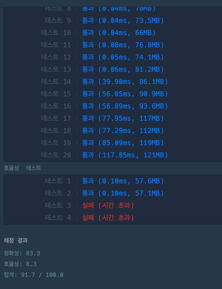

# [[프로프래머스]전화번호 목록](https://school.programmers.co.kr/learn/courses/30/lessons/42577)


- 해결방식 사고해보기
  - 해시맵을 만들어 넣고 차근차근 비교해보자 -> 시간초과 실패
  - 리스트 중 제일 작은 자리수를 가지고 비교해보면? 12,234,2345 위 케이스에서는 무조건 실패
  - for문을 한번에 돌리는 법 대체 뭘까

```java

import java.util.HashMap;
import java.util.Map;

public class 전화번호목록 {
    public static void main(String []args){
        전화번호목록 numberList = new 전화번호목록();
        String [] list1 = {
                "119", "97674223", "1195524421"
        };
        String [] list2 = {
                "123","456","789"
        };
        String [] list3 = {
                "12","123","1235","567","88"
        };

        System.out.println(numberList.solution(list1));
        System.out.println(numberList.solution(list2));
        System.out.println(numberList.solution(list3));


        String test = "12345";
        String test2 = "13242";
        String test3 = "32412";
        System.out.println(test.indexOf("12"));
        System.out.println(test2.indexOf("12"));
        System.out.println(test3.indexOf("12"));

    }


    public boolean solution(String[] phone_book) {
        boolean answer = true;
        Map<Integer,String> phoneMap = new HashMap<>();
        String currentNum = "";
        String mapNum = "";
        for(int i =0; i < phone_book.length;i++){
            int mapSize = phoneMap.size();
            currentNum = phone_book[i];
            for(int j =  0; j<mapSize;j++){
                mapNum = phoneMap.get(j);
                int idx;
                if(mapNum.length()<currentNum.length()){
                    idx = currentNum.indexOf(mapNum);
                }else{
                    idx = mapNum.indexOf(currentNum);
                }
                if(idx == 0){
                    return false;
                }
            }
            phoneMap.put(i,currentNum);
        }
        return answer;
    }


    public boolean solution2(String[] phone_book){
        boolean answer = true;
        
        return answer;
    }
}

```

