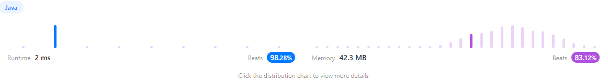

```java
/**
 * Definition for singly-linked list.
 * public class ListNode {
 *     int val;
 *     ListNode next;
 *     ListNode() {}
 *     ListNode(int val) { this.val = val; }
 *     ListNode(int val, ListNode next) { this.val = val; this.next = next; }
 * }
 */
class Solution {
    public ListNode addTwoNumbers(ListNode l1, ListNode l2) {
        if(l2 == null) {
            return l1;
        }
        if(l1 == null) {
            return l2;
        }
        ListNode list = new ListNode();
        ListNode head = list;
        int temp = 0; // 올림 자릿 수
        while(l1 != null || l2 != null || temp != 0){ // 올릴곳 없을 때까지 반복
            int sum = temp;
            if(l1 != null){
                sum += l1.val;
                l1 = l1.next;
            }
            if(l2 != null){
                sum += l2.val;
                l2 = l2.next;
            }
            if(sum >= 10){ // 10 넘으면 다음자리로 넘기기
                sum -= 10;
                temp = 1;
            }
            else{
                temp = 0;
            }
            list.val = sum;
            if(l1 != null || l2 != null || temp != 0){ // 마지막이 아니면 다음노드 호출
                list.next = new ListNode();
                list = list.next;
            }
        }
        return head;
    }
}
```

