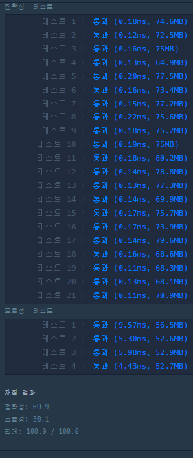

```java
import java.util.*;

class Solution {
    public int solution(int[][] maps) {
        int[][] check;
        int[] x_max = {1, 0, -1, 0}; // 우 상 좌 하
        int[] y_max = {0, 1, 0, -1}; // 우 상 좌 하

        int map_x = maps.length; // map x 길이
        int map_y = maps[0].length; // map y 길이
        check = new int[map_x][map_y]; // 체크 배열만들기
        Queue<int[]> queue = new LinkedList<>();
        queue.add(new int[]{0,0});//큐에 시작지점 담기
        check[0][0] = 1; // 초기화
        while(!queue.isEmpty())
        {
            int[] temp = queue.poll(); // 순서대로 꺼내기
            int x = temp[0]; // 첫번째 움직이기
            int y = temp[1];

            for(int i=0;i<4;i++)
            {
                int new_x = x + x_max[i];
                int new_y = y + y_max[i];
                if(new_x  < 0 || new_x  > map_x-1 || new_y <0 || new_y > map_y-1) {
                    continue;
                }
                if(check[new_x][new_y] == 0 && maps[new_x][new_y] == 1)
                {
                    check[new_x][new_y]= check[x][y] + 1;
                    queue.add(new int[]{new_x , new_y});
                }
            }

        }

        int answer = check[map_x-1][map_y-1];
        if(answer == 0) {
            answer = -1;
       }
        return answer;
    }
}
```


