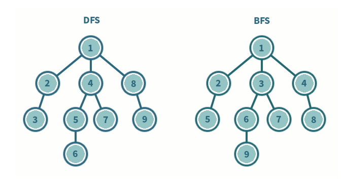

# BFS, DFS

## 뜻
BFS는 Breath First Search의 줄임말로 너비 우선 탐색을 뜻함.
DFS는 Depth First Search의 줄임말로 깊이 우선 탐색을 뜻함.

BFS, DFS 두가지 모두 그래프를 탐색하는 방법입니다.
그래프란, 정점(node)과 그 정점을 연결하는 간선(edge)으로 이루어진 자료구조의 일종을 말하며,
그래프를 탐색한다는 것은 하나의 정점으로부터 시작하여 차례대로 모든 정점들을 한 번씩 방문하는 것을 말합니다.

## BFS 
재귀적으로는 동작하지 못하는 특징이 있습니다.\
그리고 Queue를 활용하여 구현하기 때문에 FIFO (First In First Out) 을 따라줍니다.\
루트 노드(혹은 다른 임의의 노드)에서 시작해서 인접한 노드를 먼저 탐색하는 방법으로,\
시작 정점으로부터 가까운 정점을 먼저 방문하고 멀리 떨어져 있는 정점을 나중에 방문하는 순회 방법입니다.

주로 두 노드 사이의 최단 경로를 찾고 싶을 때 이 방법을 선택합니다.\
ex) 지구 상에 존재하는 모든 친구 관계를 그래프로 표현한 후 A와 Z사이에 존재하는 경로를 찾는 경우

깊이 우선 탐색의 경우 - 모든 친구 관계를 다 살펴봐야 할지도 모름\
너비 우선 탐색의 경우 - A와 가까운 관계부터 탐색

## DFS
루트 노드(혹은 다른 임의의 노드)에서 시작해서 다음 분기로 넘어가기 전에 해당 분기를 완벽하게 탐색하는 방식을 말합니다.

예를 들어, 미로찾기를 할 때 최대한 한 방향으로 갈 수 있을 때까지 쭉 가다가 더 이상 갈 수 없게 되면 다시 가장 가까운 갈림길로 돌아와서 그 갈림길부터 다시 다른 방향으로 탐색을 진행하는 것이 깊이 우선 탐색 방식이라고 할 수 있습니다.

모든 노드를 방문하고자 하는 경우에 이 방법을 선택함
깊이 우선 탐색(DFS)이 너비 우선 탐색(BFS)보다 좀 더 간단함
검색 속도 자체는 너비 우선 탐색(BFS)에 비해서 느림

### DFS 장정 과 단점
DFS의 장점과 단점은 아래와 같습니다.

장점\
현 경로상의 노드들만 기억하면 되므로 저장공간 수요가 비교적 적음\
목표 노드가 깊은 단계에 있을 경우 해를 빨리 구할 수 있음

단점\
해가 없는 경로가 깊을 경우 탐색시간이 오래 걸릴 수 있음\
얻어진 해가 최단 경로가 된다는 보장이 없음\

### 비교
DFS(깊이우선탐색)	\
현재 정점에서 갈 수 있는 점들까지 들어가면서 탐색\
스택 또는 재귀함수로 구현

BFS(너비우선탐색)\
현재 정점에 연결된 가까운 점들부터 탐색\
큐를 이용해서 구현

두 방식 모두 조건 내의 모든 노드를 검색한다는 점에서 시간 복잡도는 동일합니다.\
DFS와 BFS 둘 다 다음 노드가 방문하였는지를 확인하는 시간과 각 노드를 방문하는 시간을 합하면 됩니다.

## 깊이 우선 탐색(DFS)과 너비 우선 탐색(BFS) 활용한 문제 유형/응용

DFS, BFS은 특징에 따라 사용에 더 적합한 문제 유형들이 있습니다.

그래프의 모든 정점을 방문하는 것이 주요한 문제\
단순히 모든 정점을 방문하는 것이 중요한 문제의 경우 DFS, BFS 두 가지 방법 중 어느 것을 사용하셔도 상관없습니다.\
둘 중 편한 것을 사용하시면 됩니다.\
경로의 특징을 저장해둬야 하는 문제\
예를 들면 각 정점에 숫자가 적혀있고 a부터 b까지 가는 경로를 구하는데 경로에 같은 숫자가 있으면 안 된다는 문제 등, 각각의 경로마다 특징을 저장해둬야 할 때는 DFS를 사용합니다. (BFS는 경로의 특징을 가지지 못합니다)\
최단거리 구해야 하는 문제\
미로 찾기 등 최단거리를 구해야 할 경우, BFS가 유리합니다.\
왜냐하면 깊이 우선 탐색으로 경로를 검색할 경우 처음으로 발견되는 해답이 최단거리가 아닐 수 있지만,\
너비 우선 탐색으로 현재 노드에서 가까운 곳부터 찾기 때문에경로를 탐색 시 먼저 찾아지는 해답이 곧 최단거리기 때문입니다.\
이밖에도\
검색 대상 그래프가 정말 크다면 DFS를 고려\
검색대상의 규모가 크지 않고, 검색 시작 지점으로부터 원하는 대상이 별로 멀지 않다면 BFS