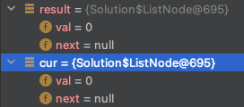
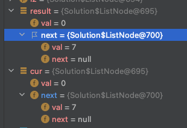
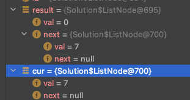
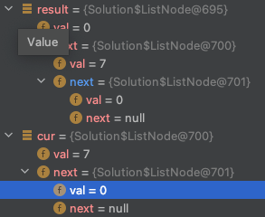
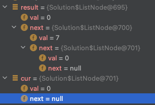
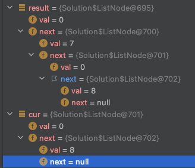

## 2. Add Two Numbers

### 간단 설명
> - 두 개의 리스트 노드의 값을 더하여 새로운 리스트 노드를 만드는 문제
> - 해당 문제는 과거에 푼 적이 있으나, 과거에 알고 있던 지식과 현재가 다르므로 새롭게 풀어 보았고, 두 로직 모두 공개하겠습니다.

### 리스트 노드
```java
/**
 * Definition for singly-linked list.
 * public class ListNode {
 *     int val;
 *     ListNode next;
 *     ListNode() {}
 *     ListNode(int val) { this.val = val; }
 *     ListNode(int val, ListNode next) { this.val = val; this.next = next; }
 * }
 */
```

### 첫 번째 정답

```java
class Solution {
    public ListNode addTwoNumbers(ListNode l1, ListNode l2) {
        List<Integer> list1 = new ArrayList<>();
        while(l1 != null) {
            list1.add(l1.val);
            l1 = l1.next;
        }
        List<Integer> list2 = new ArrayList<>();
        while(l2 != null) {
            list2.add(l2.val);
            l2 = l2.next;
        }
        int len = list1.size() > list2.size() ? list1.size() : list2.size();
        List<Integer> list = new ArrayList<>();
        int sum = 0;
        for(int i=0; i<len; i++) {
            int a = list1.size() > i? Integer.parseInt(String.valueOf(list1.get(i))) : 0;
            int b = list2.size() > i? Integer.parseInt(String.valueOf(list2.get(i))) : 0;
            int abSum = a+b+sum;
            if(abSum >= 10) {
                sum = 1;
                abSum = abSum%10;
            } else {
                sum = 0;
            }
            list.add(abSum);
            if(sum == 1 && (len-1) == i) list.add(1);
        }

        ListNode newList = null;
        for(int i=1, listLen=list.size(); i<=listLen; i++) {
            if(newList == null) {
                newList = new ListNode(list.get(listLen-i));
            } else {
                newList = new ListNode(list.get(listLen-i), newList);
            }
        }
        return newList;
    }
}
```


```java

class Solution {
    public ListNode addTwoNumbers(ListNode l1, ListNode l2) {
       //새로운 리스트 노드 생성
       ListNode result = new ListNode();
       //새롭게 생성한 리스트 노드 복사
       ListNode cur = result;
       //더한 결과가 10 이상 일 경우 10의 자리수를 기억하기 위한 변수
       int digits = 0;
       while(l1 != null || l2 != null) {
           int sum = 0;
           if(l1 != null) {
               sum += l1.val;
               l1 = l1.next;
           }
           if(l2 != null) {
               sum += l2.val;
               l2 = l2.next;
           }
           //이전에 연산한 결과에서 10의 자리수가 존재할 경우
           if(digits >= 1) {
               sum += digits;
               digits = 0;
           }
           //더한 결과가 10이 넘을 경우
           if(sum >= 10) {
               //10으로 나눈 결과 값을 저장한다.
               digits = sum/10;
               //10으로 나눈 몫을 더한다.
               sum %= 10;
           }
           //result와 cur을 바꿔도 결과는 동일하다.
           /*
            * 동일한 주소값을 바라보기 때문에 객체는 해당 주소의 값을 가진 객체가 변경 시
            * 같은 주소를 바라보는 다른 객체도 변경 된다.
            */
           cur.next = new ListNode(sum);
           //다른 객체의 주소 값을 새롭게 생긴 주소 값으로 바꿔준다.
           cur = cur.next;
       }
       //만약 마지막 연산이 2자리가 넘을 경우 넘은 자리 수의 값을 넣어 만들어준다.
       if(digits >= 1) {
           cur.next = new ListNode(digits);
       }

       //현재 result 노드의 값은 연산하지 않은 값이므로 그 다음 노드값을 반환해준다.
       return result.next;
    }
}

```


### 설명
> - 같은 주소 값을 바라 보는 객체들은 해당 주소 값의 값이 달라질 경우 값이 달라지는 것을 이용해 푼 문제다. 

## 테스트 케이스 1번으로 주소 확인해 보기
<p><strong class="example">Example 1:</strong></p>
<pre><strong>Input:</strong> l1 = [2,4,3], l2 = [5,6,4]
<strong>Output:</strong> [7,0,8]
<strong>Explanation:</strong> 342 + 465 = 807.
</pre>

### 첫 순회


### 두 번째 순회


### 세 번째 순회


### 네 번째 순회


### 다섯 번째 순회


### 여섯 번째 순회

