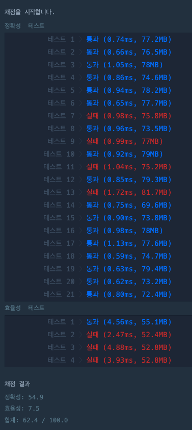
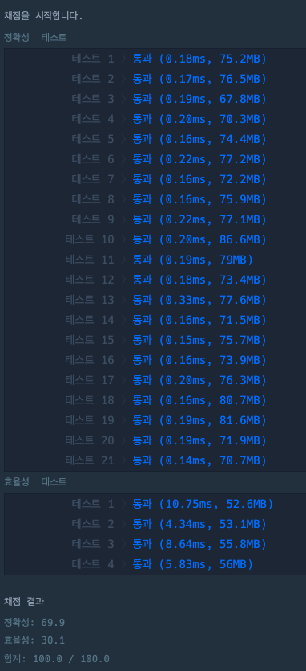

## 게임 맵 최단 거리 구하기

### 간단 설명
> 상대 팀 진영을 가는 방법 중 최단 거리를 구하는 문제

### 틀린 답
### DFS로 구현
```java
import java.util.Optional;
import java.util.PriorityQueue;
import java.util.Queue;

class Solution {
    boolean[][] visited;
    int xLength, yLength;
    int[] dx = {1,0,-1,0}, dy = {0, 1, 0, -1};
    public int solution(int[][] maps) {
        xLength = maps[0].length;
        yLength = maps.length;
        visited = new boolean[yLength][xLength];
        Queue<Integer> queue = new PriorityQueue<>((x,y) -> x-y);
        search(maps, 0, 0, 1, queue);

        return Optional.ofNullable(queue.poll()).orElse(-1);
    }

    private void search(int[][] maps, int x, int y, int count, Queue<Integer> queue) {
        if(x == xLength-1 && y == yLength-1) queue.offer(count);
        if((x < 0 || x >= xLength) || (y < 0 || y >= yLength)) {
            return;
        }
        if(maps[y][x] != 1) {
            return;
        }
        if(!visited[y][x]) {
            visited[y][x] = true;
            count++;
            for(int i = 0; i < 4; i++) {
                search(maps, x+dx[i], y+dy[i], count, queue);
            }
        }
    }

}
```

### 설명
> - 최소 값 기준으로 정렬하는 우선 순위 큐에 모든 값을 다 구한 다음 거기서 첫 번 째 값을 가져오면 해결되는 문제라 생각 
> - 그렇게 생각하여 DFS를 구현해 모든 경우의 수를 구했다고 생각했으나 틀린 케이스가 있는지 정확성 테스트 및 효율성 테스트에서 실패가 나왔다.
> - 그래서 이리저리 방법을 바꿔서 구현해봤으나, 계속 실패
> - 어떻게 할 까 고민하다가 BFS를 이용해보기로 했다.
 


### 정답
### BFS로 구현
```java
import java.util.Queue;
import java.util.LinkedList;

class Solution {

    public int solution(int[][] maps) {
        int xLength = maps[0].length, yLength = maps.length;
        //방문한 장소인지 체크(안 하게 될 경우 뒷걸음질 쳐서 무한 루프가 도는 경우가 생긴다.)
        boolean[][] visited = new boolean[yLength][xLength];
        //이동 할 위치를 변수로 잡아 반복되는 로직을 쉽게 처리하게 함
        int[] dx = {1,0,-1,0}, dy = {0, 1, 0, -1};

        //x, y, count 값을 담기 위한 int 배열로 queue를 생성
        Queue<int[]> queue = new LinkedList<>();
        
        //첫번째 좌표 0, 0 값과 초기 걸음 값 1을 담는다.
        queue.offer(new int[]{0,0,1});
        //첫번째 좌표에는 이미 존재하기 때문에 true를 담아준다.
        visited[0][0] = true;
        
        while (!queue.isEmpty()) {
          //queue에 담긴 x, y, count값을 담아준다.
          int[] xyCount = queue.poll();
          int x = xyCount[0], y = xyCount[1], count = xyCount[2];

          //상대 팀 진영에 도착한 조건
          if(x == xLength-1 && y == yLength-1) 
              return count;
          
          for(int i = 0; i < 4; i++) {
              //앞으로 이동할 방향
              int nx = x+dx[i], ny = y+dy[i];
              if(
                //게임 맵 밖으로 나갈 경우
                (nx < 0 || nx >= xLength) || (ny < 0 || ny >= yLength)
                //이미 방문했을 경우
                || visited[ny][nx]
                //이동할 장소가 벽인 경우
                || maps[ny][nx] != 1
              ) continue;
              
              //모든 조건을 통과 했다는 것은 방문 했다는 것이니 방문 표시를 한다.
              visited[ny][nx] = true;
              //이동 하는 좌표의 값을 담고 걸음 수도 +1 해준다.
              queue.offer(new int[]{nx, ny, count+1});
          }
        }
        
        /*
         * 상대 팀 진영에 도착 하지 못 하고 계속 벽을 만나 더 이상 가지 못 하게 되면
         * while 문에서 나오게 되므로 도착 방법이 없다는 -1을 반환 
         */
        return -1;
    }
}
```

### 설명
> - BFS를 구현하기 전에 틀린 이유를 한 번 생각해 보았다.
> - 어쩌면, DFS를 이용했을 때는 처음에 벽을 계속 마주하지 않고 계속 진입하여 상대 팀 진영에 도착하였는데, 그 다음 진입할 때는 최소한의 경로로 갈 수 있지만 이미 진입하였기 때문에 해당 경로로 진입을 못 하여서 문제가 생겼을 것이라 생각이 든다....    
> - 그래서 이번에는, 우선 계속 한번에 같이 진입을 하고 거기서 도착하면 종료되게 구현하였다.
> - 결과는 통과였다.
> - 최근에 이런 비슷한 문제로 시험이 나왔는데, 해당 문제는 몇 번 더 연습하는게 좋을 것 같다....

