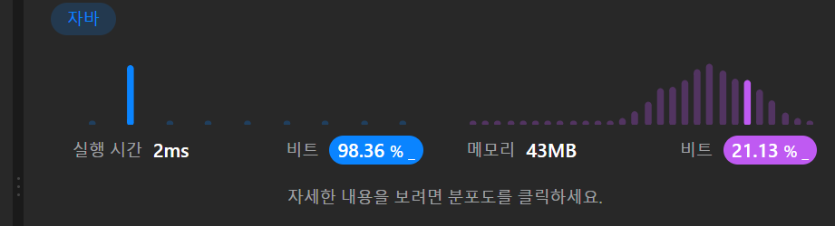

```java
 public ListNode addTwoNumbers(ListNode l1, ListNode l2) {
            ListNode temp = new ListNode(0); // 결과 연결 리스트를 위한 예비 노드
            ListNode current = temp; // 결과 연결 리스트의 현재 노드
            int carry = 0; // 올림수

            // 입력 연결 리스트를 순회.
            while (l1 != null || l2 != null) {
                int sum = carry; // 합을 자릿수 올림으로 초기화.
                if (l1 != null) {
                    sum += l1.val; // 첫 번째 연결 리스트 노드의 값을 더함.
                    l1 = l1.next;
                }
                if (l2 != null) {
                    sum += l2.val; // 두 번째 연결 리스트 노드의 값을 더함.
                    l2 = l2.next;
                }

                carry = sum / 10; // 자릿수 올림을 업데이트.
                current.next = new ListNode(sum % 10); // 결과 연결 리스트에
                current = current.next; // 결과 연결 리스트의 현재 노드
            }

            if (carry != 0) {
                current.next = new ListNode(carry); // 마지막 자릿수 올림을 결과 연결 리스트에 추가.
            }

            return temp.next; // 예비 노드를 제외한 결과 연결 리스트를 반환.
        }
```