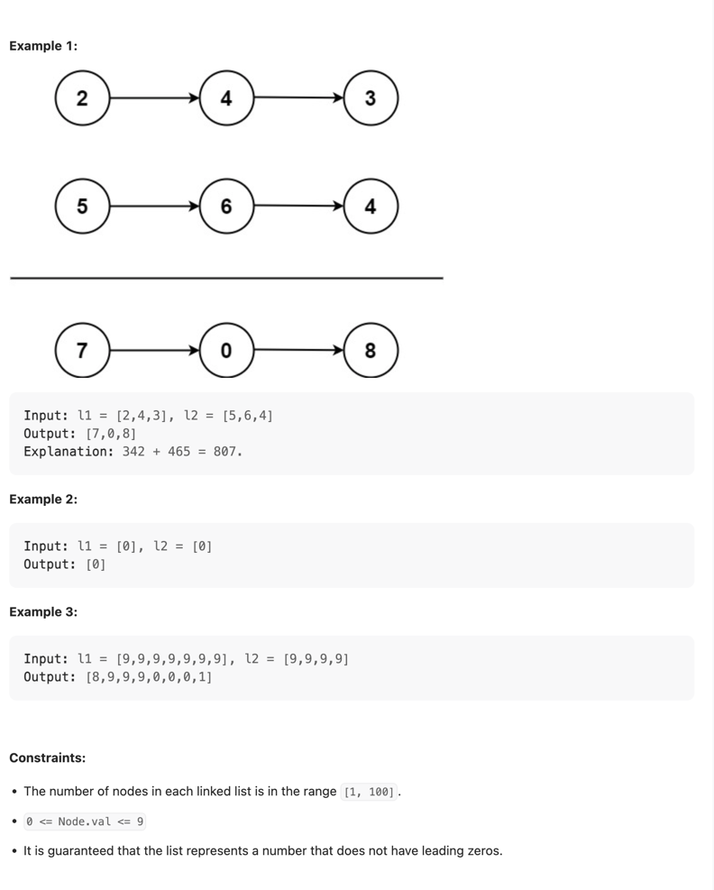

> https://leetcode.com/problems/add-two-numbers/

---
~~~java
/**
 * Definition for singly-linked list.
 * public class ListNode {
 *     int val;
 *     ListNode next;
 *     ListNode() {}
 *     ListNode(int val) { this.val = val; }
 *     ListNode(int val, ListNode next) { this.val = val; this.next = next; }
 * }
 */
class Solution {
    ListNode answer = null;
    public ListNode addTwoNumbers(ListNode l1, ListNode l2) {
        int div = 0;
        ListNode answer = new ListNode();
        ListNode current = answer;

        while (l1 != null || l2 != null) {
            int num1 = l1 != null ? l1.val : 0;
            int num2 = l2 != null ? l2.val : 0;
            int sum = num1 + num2 + div;

            current.next = new ListNode(sum % 10);
            current = current.next;

            div = sum / 10;

            l1 = l1 != null ? l1.next : null;
            l2 = l2 != null ? l2.next : null;
        }

        if (div > 0) current.next = new ListNode(div);
       
        return answer.next;
    }
}
~~~