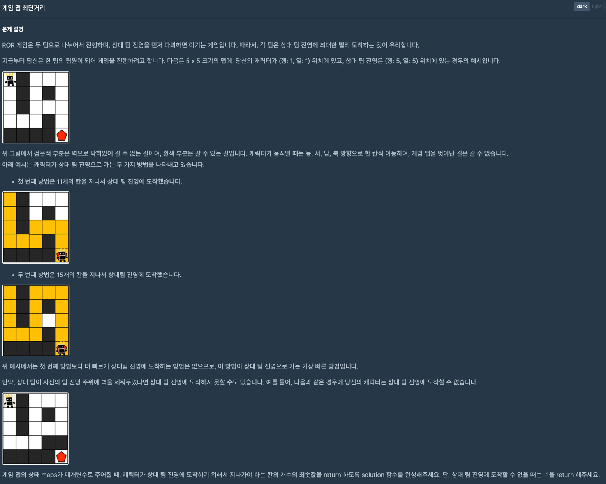
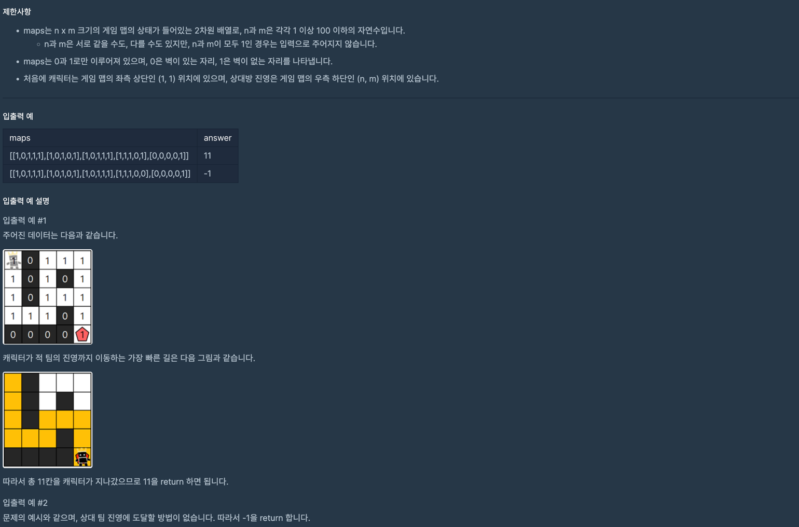
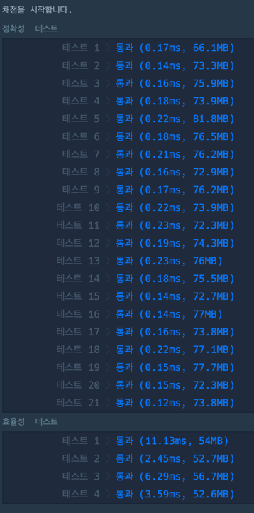
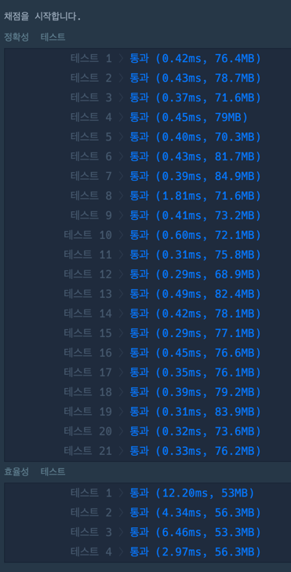

> https://school.programmers.co.kr/learn/courses/30/lessons/1844

---

> 최종 1 (배열사용)

~~~java
import java.util.*;

class Solution {
    
    public int solution(int[][] maps) {
        int successDistance = Integer.MAX_VALUE;
        final var maxRowIndex = maps.length - 1;
        final var maxColIndex = maps[0].length - 1;
        Queue<int[]> queue = new LinkedList();
        queue.add(new int[]{0, 0, 1});

        while (!queue.isEmpty()) {
            final var current = queue.poll();

            if (maps[current[0]][current[1]] != 0) {

                if (current[0] == maxRowIndex && current[1] == maxColIndex) {
                    successDistance = Math.min(successDistance, current[2]);
                } else {
                    if (current[2] < successDistance) {
                        maps[current[0]][current[1]] = 0;

                        // 오른쪽
                        if (maxColIndex > current[1] && maps[current[0]][current[1] + 1] == 1) {
                            queue.add(new int[]{current[0], current[1] + 1, current[2] + 1});
                        }

                        // 왼쪽
                        if (current[1] > 0 && maps[current[0]][current[1] - 1] == 1) {
                            queue.add(new int[]{current[0], current[1] - 1, current[2] + 1});
                        }

                        // 위
                        if (current[0] > 0 && maps[current[0] - 1][current[1]] == 1) {
                            queue.add(new int[]{current[0] - 1, current[1], current[2] + 1});
                        }

                        // 아래
                        if (maxRowIndex > current[0] && maps[current[0] + 1][current[1]] == 1) {
                            queue.add(new int[]{current[0] + 1, current[1], current[2] + 1});
                        }
                    }
                }
            }
        }

        return successDistance == Integer.MAX_VALUE ? -1 : successDistance;
    }
}
~~~

---
> 최종 2 (노드 클래스 사용)

~~~java
import java.util.*;

class Solution {
    
    class Node {
        int row;
        int col;
        int distance;

        public Node(int row, int col, int distance) {
            this.row = row;
            this.col = col;
            this.distance = distance;
        }
    }
    
    public int solution(int[][] maps) {
        int successDistance = Integer.MAX_VALUE;
        final var maxRowIndex = maps.length - 1;
        final var maxColIndex = maps[0].length - 1;
        Queue<Node> queue = new LinkedList();
        queue.add(new Node(0, 0, 1));

        while (!queue.isEmpty()) {
            final var current = queue.poll();
            
            if (maps[current.row][current.col] != 0) {
                
                if (current.row == maxRowIndex && current.col == maxColIndex) {
                    successDistance = Math.min(successDistance, current.distance);
                } else {
                    if (current.distance < successDistance) {
                        maps[current.row][current.col] = 0;

                        // 오른쪽
                        if (maxColIndex > current.col && maps[current.row][current.col + 1] == 1) {
                            queue.add(new Node(current.row, current.col + 1, current.distance + 1));
                        }

                        // 왼쪽
                        if (current.col > 0 && maps[current.row][current.col - 1] == 1) {
                            queue.add(new Node(current.row, current.col - 1, current.distance + 1));
                        }

                        // 위
                        if (current.row > 0 && maps[current.row - 1][current.col] == 1) {
                            queue.add(new Node(current.row - 1, current.col, current.distance + 1));
                        }

                        // 아래
                        if (maxRowIndex > current.row && maps[current.row + 1][current.col] == 1) {
                            queue.add(new Node(current.row + 1, current.col, current.distance + 1));
                        }
                    }
                }
            }
        }

        return successDistance == Integer.MAX_VALUE ? -1 : successDistance;
    }
}
~~~

---
