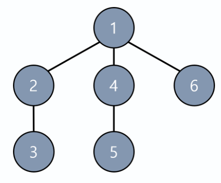
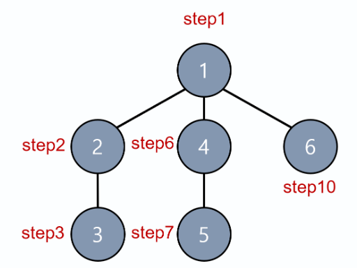
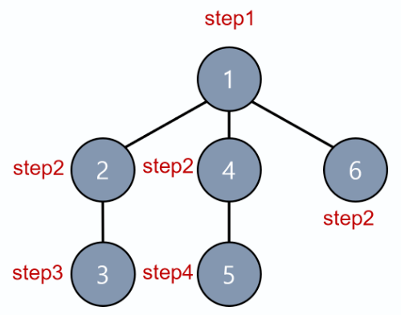

# DFS (깊이 우선 탐색)

> DFS란 깊은 부분을 우선적으로 탐색하는 알고리즘이다. 즉, 그래프를 탐색할 때 특정한 경로로 쭉 타고 밑바닥까지 내려간 후 막다른 길에 도착하면 다시돌아와 다른 경로로 탐색한다.

---

## 동작방식

> 스택 기반의 LIFO 방식

1. 탐색 시작 노드를 스택에 삽입하고 방문 처리
2. 스택의 최상단 노드에 방문하지 않은 인접한 노드가 있으면 그 노드를 스택에 넣고 방문 처리를 한다.
   1. 인접 노드가 여러개 있으면 번호가 낮은 순서부터 처리
   2. 방문하지 않은 인접 노드가 없으면 스택에서 최상단 노드를 꺼낸다
3. 2번의 과정을 더이상 수행할 수 없을 때까지 반복한다.

### 탐색 단계별 스택 데이터

- step1 : 1
- step2 : 1,2
- step3 : 1,2,3
- step4 : 1,2
- step5 : 1
- step6 : 1,4
- step7 : 1,4,5
- step8 : 1,4
- step9 : 1
- step10 : 1,6
- step11 : 1
- step12 :

---

# BFS (너비 우선 탑색)

> BFS란 가까운 노드부터 탐색하는 알고리즘이다.

---

## 동작방식

> 큐 기반의 FIFO 방식

1. 탐색 시작 노드를 큐에 삽입하고 방문 처리
2. 큐에서 노드를 꺼내 해당 노드의 인접 노드 중에서 방문하지 않은 노드를 모두 큐에 삽입하고 방문처리를 한다.
3. 2번의 과정을 더 이상 수행할 수 없을 때까지 반복한다.

### 탐색 단계별 큐 데이터

- step1 : 1
- step2 : 2,4,6
- step3 : 4,6,3
- step4 : 6,3,5
- step5 : 3,5
- step6 : 5
- step7 :

---

# DFS vs BFS

|- |**DFS**|**BFS**|
|------|---|---|
|동작원리|스택|큐|
|구현|재귀|큐|
|장점|깊이가 깊을 수록 빠름, 메모리가 적음|찾는 노드가 인접할 경우 유리|
|단점|스택오버플로우|노드가 많을 수록 메모리를 많이 소비|
|적용사례|- 경로의 특징 저장  - 길찾기  - 미로|- 길찾기,라우팅  - 웹 크롤러 - 주변 위치 찾기|