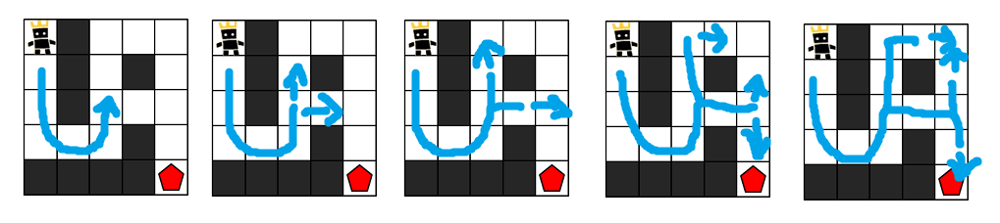

# DFS와 BFS
  
## DFS와 BFS란?
깊이 우선 탐색(Depth First Search)과 너비 우선 탐색(Breadth First Search)의 약자이다.  

## 이진 트리 탐색의 경우
DFS는 깊이가 가장 깊은 노드까지 탐색한 뒤 다음 노드를 찾아나가는 방식을 말한다.  
전위, 중위, 후위 순회의 경우 DFS를 실행하며 어느 시점에서 검사하는지에 따라 달라진다.    
BFS는 같은 높이의 노드를 모두 검사한 후 다음 높이의 노드를 검사하는 방식을 말한다. 레벨 순회와 같다.  

## 알고리즘에서
  
DFS는 탈출 조건을 만족할 때 까지 실행한 후 조건을 만족하면 다른 분기를 찾는다.  

  
BFS는 현재 시점에서의 모든 가능성을 찾아본 뒤 가능한 분기를 찾는다.  

## 구현 관점에서
```python
DFS(root)
def DFS(node):
  if node == None:
    return

  DFS(node.left)
  DFS(node.right)
```
DFS 구현에는 보통 재귀를 사용한다.  
재귀를 이용할 시 조건을 만족할 때 까지 콜 스택을 먼저 쌓기 때문에  
우선 가장 마지막 조건을 만족할 때 까지 호출을 반복한다.  


```python
BFS(root)
def BFS(node):
  queue = [node]
  while queue:
    now = queue.pop()
    if now.left:
      queue.append(now.left)
    if now.right:
      queue.append(now.right)
```
BFS 구현에는 보통 큐를 사용한다.  
큐에 현재 시점에서 가능한 모든 경우의 수를 먼저 쌓아넣기 때문에  
현재 시점에서 가능한 모든 경우의 수를 먼저 검사한다.  

## 장단점
### DFS
* 장점
  * 직관적인 코드를 작성할 수 있다.
  * 탈출 조건에 따라 성능이 더 좋아질 수 있다. (운 좋게 첫 조건이 최적해의 경우)
* 단점
  * 조건을 확인할 때 마다 함수를 호출하기 때문에 오버헤드가 심하다.
  * 확인해야 할 조건이 많을수록 성능이 저하한다. (최악의 경우)

### BFS
* 장점
  * 함수 호출로 인한 오버헤드가 적다.
  * 최적해를 찾는 것을 항상 보장한다.
* 단점
  * 최소 실행 시간보다는 느리다는 것이 거의 확실하다.
  * 최악의 경우 가장 느리다.