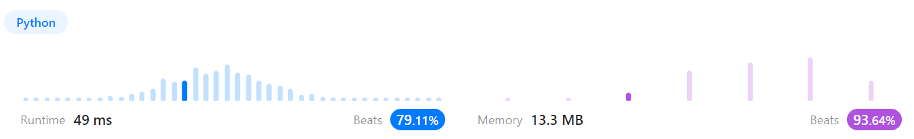
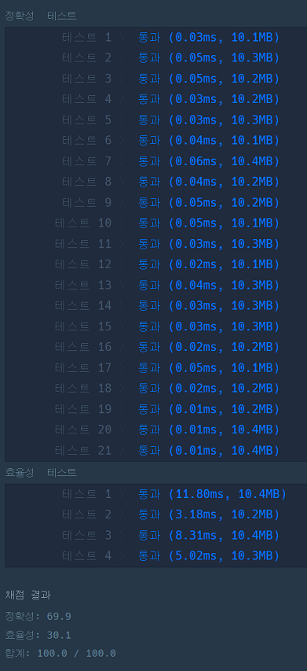

# 문제풀이
## 2. Add Two Numbers

### Discription  
요약) 두 개의 리스트가 주어졌을 때 두 리스트의 합을 가진 리스트를 반환하라. 이 때 올림수가 발생할 경우 다음 노드에 더하여 반환한다.  
https://leetcode.com/problems/add-two-numbers/description/  

### Solution

```python
# Definition for singly-linked list.
# class ListNode(object):
#     def __init__(self, val=0, next=None):
#         self.val = val
#         self.next = next
class Solution(object):
    def __init__(self):
        self.carry = 0

    def addTwoNumbers(self, l1, l2):
        """
        :type l1: ListNode
        :type l2: ListNode
        :rtype: ListNode
        """
        node_sum = l1.val + l2.val
        if node_sum > 9:
            self.carry = 1
            node_sum -= 10
        root = ListNode(node_sum)
        pointer = root
        l1 = l1.next
        l2 = l2.next

        while l1 or l2:
            if not l1:
                l1 = ListNode(0)
            if not l2:
                l2 = ListNode(0)

            node_sum = 0
            if self.carry == 1:
                node_sum = 1
                self.carry = 0
            
            node_sum += (l1.val + l2.val)
            if node_sum > 9:
                self.carry = 1
                node_sum -= 10
            
            pointer.next = ListNode(node_sum)
            pointer = pointer.next
            l1 = l1.next
            l2 = l2.next
        
        if self.carry == 1:
            pointer.next = ListNode(1)

        return root
```
  
올림이 발생했는지 판단할 carry 변수를 미리 선언해두고 두 리스트노드의 값을 더한다  
더한 값이 10 이상일 경우 carry 변수값을 올리고 결과값에서 10을 뺀다  
다음 노드를 계산할 때 carry 값이 있을 경우 계산 결과값에 더한다  
여기에서 결과값이 10 이상일 경우 위와 같이 반복한다  
리스트의 길이가 한쪽이 더 길 경우 0 노드가 있는 것으로 취급하고 실행한다  

## 게임 맵 최단거리

### 문제 설명
요약)  
n x m 크기의 배열이 제공되었을 때 (0, 0)에서 출발하여 (n-1, m-1)에 도착하는 최단거리를 구하라.  
목적지에 도달할 수 없을 경우는 -1을 반환한다.   
https://school.programmers.co.kr/learn/courses/30/lessons/1844  

### Solution

```python
min_len = 0
y_max = 0
x_max = 0

def solution(maps):
    global min_len
    global y_max
    global x_max
    
    min_len = -1
    y_max = len(maps) -1
    x_max = len(maps[0]) -1
    
    fill(0, 0, maps, 1)
    
    return min_len

def fill(y, x, maps, cur_len):
    global min_len
    global y_max
    global x_max
    
    if (y < 0 or y >= y_max) or (x < 0 or x >= x_max):
        return
    
    if maps[y][x] == 0:
        return
    
    if y==y_max and x==x_max:
        if min_len == -1:
            min_len = cur_len
        else:
            min_len = min(min_len, cur_len)
        return
    
    maps[y][x] = 0

    fill(y, x+1, maps, cur_len+1) # 우
    fill(y+1, x, maps, cur_len+1) # 하
    fill(y-1, x, maps, cur_len+1) # 상
    fill(y, x-1, maps, cur_len+1) # 좌
```
섬 개수 구하기 코드를 응용한 dfs 구현  
콜 스택 오버플로우가 발생하여 통과하지 못했다.  
먼저 확인하는 순서를 틀릴 경우 답이 틀린다.  

```python
from collections import deque

def solution(maps):
    min_len = -1
    y_max = len(maps) -1
    x_max = len(maps[0]) -1
    
    y_move = [0, 1, -1, 0] # 우 하 상 좌
    x_move = [1, 0, 0, -1] # 우 하 상 좌
    q = deque([(0, 0)])
    dist = 1
    
    while q:
        current = q.popleft()
        y = current[0]
        x = current[1]

        for i in range(4):
            dy = y + y_move[i]
            dx = x + x_move[i]
            
            if (dy >= 0 and dy <= y_max) and (dx >= 0 and dx <= x_max):
                if maps[dy][dx] == 1:
                    maps[dy][dx] = maps[y][x] + 1
                    q.append((dy, dx))
                    
    if maps[y_max][x_max] != 1:
        min_len = maps[y_max][x_max]
    
    return min_len
```
  
bfs를 이용한 길찾기 구현  
이미 지나간 길에 지나온 거리를 표기한다  
한 번 지나간 곳을 다시 갔을 경우 종료된다  
bfs는 현재 시점에서의 경우의 수를 먼저 판단하기 때문에  
최단거리가 가장 먼저 구해진다  

[n-1, m-1]에 거리가 표시되어 있으면 도착한 것이므로 거리를 반환한다  
n과 m이 모두 1인 경우는 없기 때문에 거리가 1로 남아있으면 도착하지 못한 것이다  
