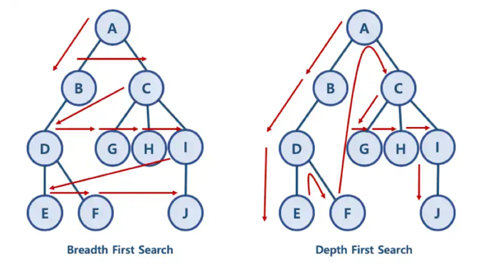

# DFS

- 깊이우선탐색 알고리즘
- 그래프탐색 알고리즘의 일종
- 특정개채를 찾기위한 알고리즘
- 재귀함수로 구현하는 것이 일반적
- 재귀를 타서 탈출조건에 먼저 도달하고 그 다음에 파라미터를 바꿔가는 방식으로 문제 구현

# BFS

- 너비우선탐색 알고리즘
- 순서가 보장되어야 하기 때문에 큐나 링크드 리스트를 이용해 구현
- 가장 먼저 리스트나 큐에 넣었던 것을 꺼내어 연결된 점을 큐에 넣고 큐가 빌때까지 반복함

# DF대표적인 문제유형 

1. 경로탐색 문제(최단거리,시간)
2. 네트워크유형 (연결)
3. 모든 조합 만들기

# 둘 중 어떤 것을 써야할까?

- 둘 다 탐색 알고리즘이기 때문에 어떤 방식을 이용해도 정답은 나온다. 
- DFS는 동작을 검증하기가 쉬움. 재귀를 이용하여 하나만 계속 호출하기 때문에 
- BFS는 한번에 여러조합을 한칸씩 만들기 때문에 조합이 완성되어 비교하는 시점에 흐름을 파악하기 어려움
- 그러나 DFS는 한 조합에서 시간이 너무 오래걸릴 경우 시간초과가 날 수 있따. = 수행시간 복불
- BFS는 하나의 답을 찾고나면 나머지 답은 정답에서 제외되기 때문에 시간복잡도가 낮다.

