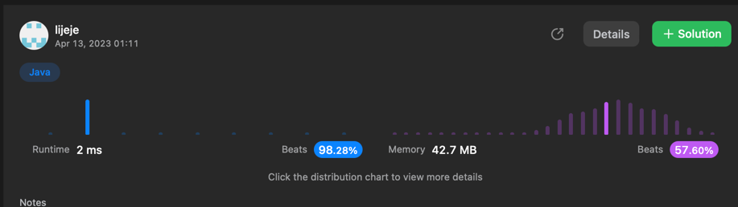

```java
/**
 * Definition for singly-linked list.
 * public class ListNode {
 *     int val;
 *     ListNode next;
 *     ListNode() {}
 *     ListNode(int val) { this.val = val; }
 *     ListNode(int val, ListNode next) { this.val = val; this.next = next; }
 * }
 */
class Solution {
    public ListNode addTwoNumbers(ListNode l1, ListNode l2) {
        ListNode nodeList = new ListNode(0);
        ListNode l3 = nodeList;
        int quotien = 0;
        while(l1 != null || l2 != null){
            
            int l1val = (l1 != null)? l1.val:0;
            int l2val = (l2 != null)? l2.val:0;

            int sum = l1val + l2val + quotien;
            quotien = sum/10;
            int remainder = sum%10;
            //System.out.println(l1val + "/" +l2val+ "/"+sum+ "/"+quotien+ "/"+remainder);

            ListNode newNode = new ListNode(remainder);
            //System.out.println(newNode.val);
            l3.next = newNode;
            
            if(l1 != null) l1 = l1.next;
    K
            if(l2 != null) l2 = l2.next;
            l3 = l3.next;
        }
        
        if(quotien>0){
            ListNode newNode = new ListNode(quotien);
            l3.next = newNode;
            l3 = l3.next;
        }

        return nodeList.next;
    }
}
```