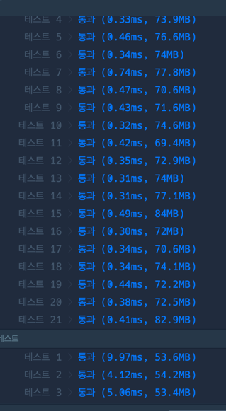

```java
import java.util.LinkedList;
import java.util.Queue;

public class Solution {
	static int[] dx = {-1,1,0,0};
	static int[] dy = {0,0,-1,1};
	static boolean[][] visited;//방문배열
	
	public static int solution(int[][] maps) {
		int answer = -1;
		visited = new boolean[maps.length][maps[0].length];
		Queue<Info> queue = new LinkedList<Info>();
		
		queue.add(new Info(0, 0, 1));
		visited[0][0]=true;
	
		while(!queue.isEmpty()) {
			Info p = queue.poll();
			int nowX = p.x;
			int nowY = p.y;
			int nowD = p.dis;
			
			if(nowX==maps.length-1 && nowY==maps[0].length-1) {
				answer = nowD;
				break;
			}


			for(int i=0; i<4; i++) {
				int nextX = nowX + dx[i];
				int nextY = nowY + dy[i];

				if(nextX>=0 && nextY>=0 && nextX<maps.length && nextY<maps[0].length) {
					
					if(maps[nextX][nextY]==1 && !visited[nextX][nextY]) {
						queue.add(new Info(nextX, nextY, nowD+1));
						visited[nextX][nextY]=true;
					}
				}
			}//for
		}//while
		
		return answer;
	}
}


class Info{
	int x;
	int y;
	int dis;
	public Info(int x, int y, int dis) {
		this.x = x;
		this.y = y;
		this.dis = dis;
	}
}
```

